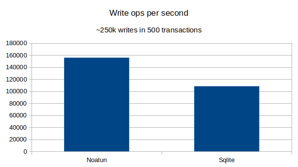
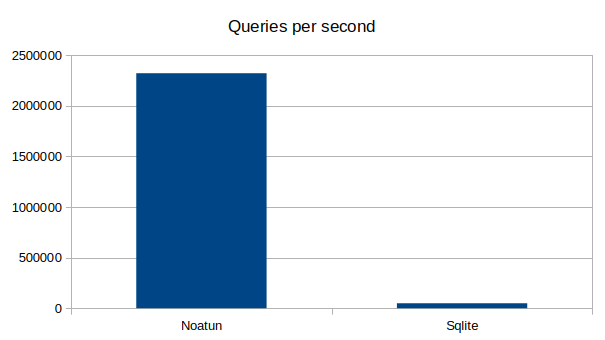

[](https://github.com/avl/noatun/actions/workflows/rust.yml)
[](https://github.com/avl/noatun/actions/workflows/clippy.yml)
[](https://github.com/avl/noatun/actions/workflows/miri.yml)
[](https://github.com/avl/noatun/actions/workflows/visualizer.yml)

# Noatun

Welcome to Noatun!

Noatun is an in-process, multi-master, distributed database with automatic
garbage collection and materialized view support. It is 100% written in Rust.
Noatun currently supports linux.

## When to use Noatun

Noatun might be a good choice if:

 * You need "offline first", multi-master semantics
 * You need very fast query performance
 * Your system is well modeled using an "event sourcing" approach
 * Events interact in complex ways

## When not to use Noatun

Noatun might be a bad fit when:

 * You don't need replication
 * You need to store large amounts of data with minimal on-disk overhead
 * Your active data set does not fit in RAM
 
## How using Noatun works

 * Define your messages
 * Define rules to apply messages to a materialized view
 * Noatun applies messages in order, time-traveling as needed if messages arrive out-of-order
 * Query materialized view using native rust

## Noatun properties

 * Synchronizes messages efficiently over networks
 * Automatically prunes messages that no longer have any effect
 * Fast, in-process, memory mapped materialized view

## Resources

[Rust Docs](https://docs.rs/noatun/latest/noatun/) 

[Manual](https://github.com/avl/noatun/blob/master/docs/docs.md)

## Limitations

 * Noatun is very new. There is an extensive test suite, but there may be bugs.
 * Currently only linux is supported. Macos/windows support is possible, and PR:s are welcome.
 * Only 64 bit, little endian machines are supported. This includes arm and x86_64. This restriction
   could be lifted if interest exists. 

## Benchmark

See "db_bench"-subfolder for more information. As always, do your own benchmarking, your mileage
may vary. This benchmark compares Noatun with sqlite. Note that sqlite is a different class of product, 
without the multi-master replication features of noatun. Suggestions for other products to benchmark
against are welcome!

_Writes_:



_Queries_:



Noatun write speed is expected to be similar to Sqlite, because a similar amount of work needs
to be performed. Noatun write speed will be reduced with more complex materialization rules.
Sqlite write performance is affected by the complexity of indices. Generally, for large bulk writes,
Sqlite is expected to be faster.

For simple queries in a moderately sized database, Noatun will likely always be significantly faster than 
Sqlite. The reason is that noatun queries are written in rust, and operate directly on memory-mapped RAM.
For complex queries, sqlite query optimizer may give it the edge in case the dataset does not fit in RAM. 
 
## Examples

The folder `examples` contains several examples. `examples/issue_tracker.rs` contains a ratatui-based
issue tracker.

## Sample code

Check the `examples`-folder for examples that feature distribution.

```rust
// Simple app to show using a noatun db, without any replication
use anyhow::Result;
use noatun::data_types::{NoatunHashMap, NoatunString};
use noatun::database::{DatabaseSettings, OpenMode};
use noatun::{noatun_object, Database, Message, MessageId, Object, SavefileMessageSerializer};
use savefile_derive::Savefile;
use std::pin::Pin;

// Define our database schema
noatun_object!(
    struct ExampleDb {
        pod total_salary_cost: u32,
        object employees: NoatunHashMap<NoatunString, Employee>,
    }
);

// Define the Employee type used in the database schema
//
// This generates the Employee type used internally in the database, as well as an
// external type called EmployeeNative, that is a regular rust struct that can be used
// as a vessel for importing and exporting data from the database.
noatun_object!(
    #[derive(PartialEq)]
    struct Employee {
        object name: NoatunString,
        pod salary: u32
    }
);


// Define our event (in real projects, this would usually be an enum)
#[derive(Savefile, Debug)]
pub struct ExampleMessage {
    name: String,
    salary: u32,
}

impl Message for ExampleMessage {
    type Root = ExampleDb;
    type Serializer = SavefileMessageSerializer<Self>;

    // Define a rule for applying the message to the database
    fn apply(&self, _time: MessageId, root: Pin<&mut Self::Root>) {
        // The `noatun_object!` macro generates a 'pin_project' method that
        // gives safe pinned access to all the fields of the object. 
        let root = root.pin_project();

        let new_total_salary = root.total_salary_cost.export() + self.salary;
        root.total_salary_cost.set(new_total_salary);

        root.employees.insert(
            self.name.as_str(),
            // We can't directly create `Employee` instances directly, but we can
            // create `EmployeeNative` instances which are converted automatically by noatun.
            &EmployeeNative {
                name: self.name.clone(),
                salary: self.salary,
            },
        );
    }
}

fn main() -> Result<()> {
    // Create a new database
    let mut db: Database<ExampleMessage> = Database::create_new(
        "test/example1.bin",
        OpenMode::Overwrite,
        DatabaseSettings::default(),
    )
    .unwrap();

    // Add some messages
    let mut s = db.begin_session_mut()?;
    s.append_local(ExampleMessage {
        name: "Andersen".to_string(),
        salary: 25,
    })?;
    s.append_local(ExampleMessage {
        name: "Smith".to_string(),
        salary: 20,
    })?;
    s.commit()?;
    
    let s = db.begin_session()?;
    let mut employees: Vec<_> = s.with_root(|root| {
        // Verify total salary is expected value
        assert_eq!(root.total_salary_cost.get(), 45);
        // Extract the list of employees
        root.employees.export().values().cloned().collect()
    });

    
    employees.sort_by_key(|emp| emp.name.clone());
    
    // Verify the database contains the employees we expect 
    assert_eq!(
        employees,
        vec![
            EmployeeNative {
                name: "Andersen".to_string(),
                salary: 25,
            },
            EmployeeNative {
                name: "Smith".to_string(),
                salary: 20,
            },
        ]
    );

    Ok(())
}

```
