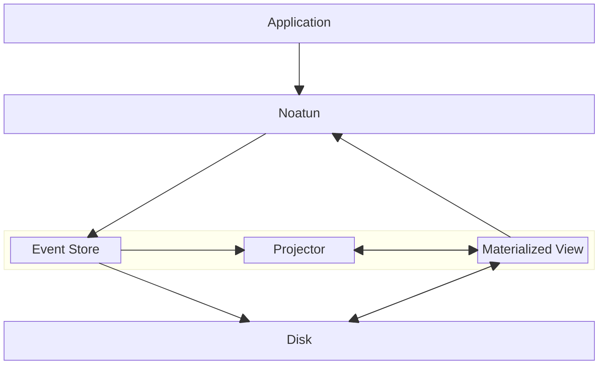
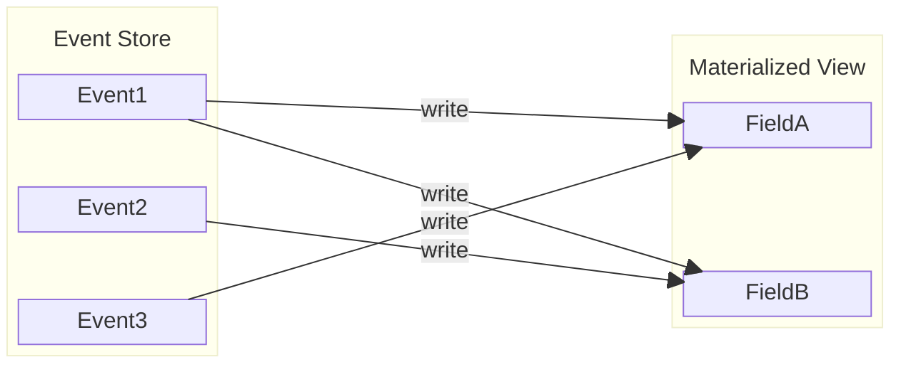
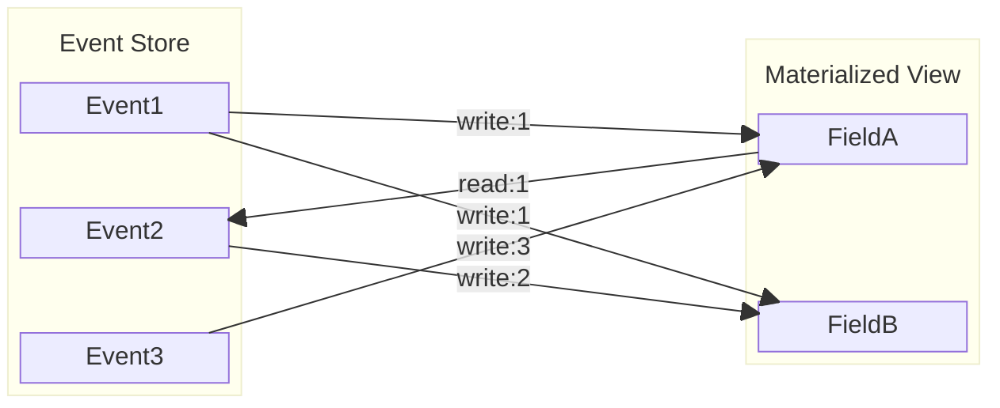
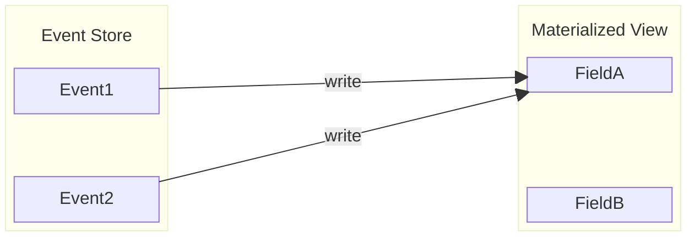
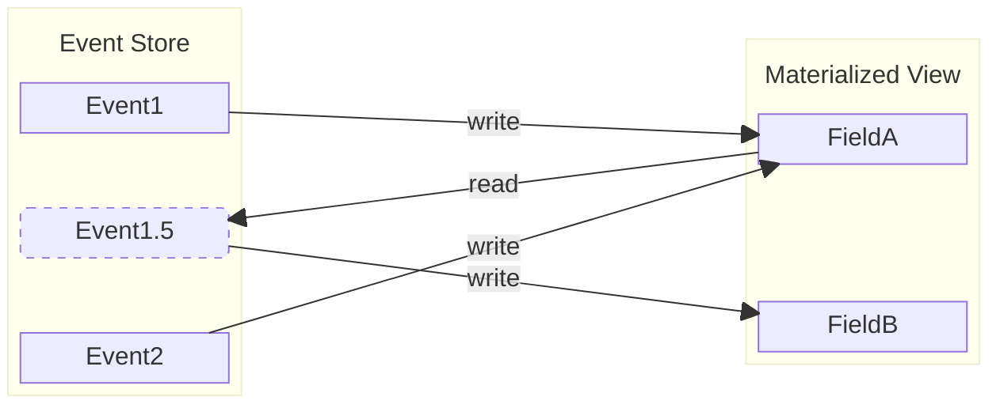

# Introduction to Noatun

Welcome to Noatun! Noatun is an in-process, multi master, distributed event sourced database with automatic
garbage collection and an automatically materialized view. It's suitable for unreliable networks and can be 
used in embedded applications (std required).

Features:

 * Multi master distribution - writes can be made on any node, even when offline
 * 100% decentralized - nodes in the network do not need to be assigned unique ids - all they need
   to agree on is the message format. 
 * Data model is 100% event based. Current database state is a function only of current events.
 * Works in any network - and does not require unique network addresses
 * Deterministic replay and time travel for easy debugging
 * Robust persistent store optimized for availability
 * Automatic pruning of old messages
 * Excellent read performance. Reading from Noatun is almost as fast as reading from regular pure 
   rust data structures in RAM.
 * Good write performance. Writing messages to disk is very fast, and projecting them
   to the materialized view is often reasonable fast too, but depends on the user logic.

## Functional overview

At the base of Noatun is an event log. Everything that happens in a Noatun database happens
because of an event. The only way to affect the state of a Noatun database is to create an event.

Each Noatun database has two parts: 
 * Event store: contains all events in the database
 * Materialized view: maintained by "applying" all events in order

_Information flow (in operation)_



Events are applied to the projection in timestamp order. As a user of Noatun, you need to
implement a method that applies an event to the database [`Message::apply`]. Noatun 
then ensures that the materialized view is always just the result of applying all events 
in order. Noatun will, under the hood, efficiently roll back and reapply events if they 
arrive over the network out of order.

However, events don't necessarily remain in the database forever. If all the effects of an
event have been overwritten by later events, Noatun will prune the first event. This means
that a Noatun application can work for an indefinite time period without growing indefinitely
in size (given that previous events are actually logically subsumed by later events).

## Complete example

Let's say you wanted to track the number of bolts in a warehouse. Bolts are added
to the warehouse, removed, and occasionally an inventory is performed where the number
of bolts are counted to make sure the tally is correct.

Example code:

```rust
use noatun::{Database, OpenMode, MessageId, noatun_object, Message, DatabaseSettings, PostcardMessageSerializer};
use noatun::communication::{DatabaseCommunication, DatabaseCommunicationConfig};
use noatun::communication::udp::TokioUdpDriver;
use serde_derive::{Serialize, Deserialize};
use tokio::time::Duration;
use std::pin::Pin;
use std::io::Write;

/// Defines our events
/// 
/// For serialization of events (to disk and on network), we use 
/// serde + postcard. However, Noatun itself isn't tied to serde in 
/// any way (see further below). 
#[derive(Debug, Serialize, Deserialize)]
pub enum WarehouseEvent {
    Add(u32),
    Remove(u32),
    Inventory(u32)
}

/// Define our root database object. Here we have a single pod (plain old data) field of type u32.
/// See docs for what types are supported by the noatun_object macro.
/// It is also possible to implement completely custom types by implementing the [`noatun::Object`]
/// macro manually.
noatun_object!(
    struct Warehouse {
        pod quantity: u32
    }
);

/// Implement Message for our WarehouseEvent, to tell Noatun how to apply these events to the db
impl Message for WarehouseEvent {
    /// The type of database root this event must be used with
    type Root = Warehouse;
    
    /// The on-disk/on-wire format of messages is customizable.
    /// Here we use the serde-based "postcard" serializer.
    type Serializer = PostcardMessageSerializer<Self>;
    
    /// A function which applies an event to a database with `Warehouse`
    /// as its root object.
    fn apply(&self, _id: MessageId, root: Pin<&mut Warehouse>) {
        let mut root = root.pin_project();
        match self {
            WarehouseEvent::Add(delta) => {
                root.quantity += *delta;
            }
            WarehouseEvent::Remove(delta) => {
                root.quantity -= *delta;
            }
            WarehouseEvent::Inventory(qty) => {
                root.quantity.set(*qty);
            }
        }
    }
}

/// Open a database, add some events, and then synchronize with any
/// other reachable noatun nodes.
async fn example() {
    
    /// Create the database on disk
    /// Note, this example creates a purely local database. See further examples
    /// for how to setup synchronization.
    let mut db: Database<WarehouseEvent> = Database::create_new(
        "warehouse_db",
        OpenMode::OpenCreate,
        DatabaseSettings::default(),
    ).unwrap();

    /// Arrange for the database to be distributed
    /// We use a standard UDP driver here, but anything implementing the trait
    /// [`noatun::CommunicationDriver`] can be used.
    let distributed_db = DatabaseCommunication::new_custom(
        &mut TokioUdpDriver, 
        db,
        DatabaseCommunicationConfig::default())
        .await
        .unwrap();
    
    // Add two events, adding a quantity of 43, and then subtracting 1
    distributed_db.add_message(WarehouseEvent::Add(43)).await.unwrap();
    distributed_db.add_message(WarehouseEvent::Remove(1)).await.unwrap();


    distributed_db.with_root(|root|{
        // The current quantity in the database should now be 42.
        assert_eq!(*root.quantity, 42);
    });
    
    // ... run application.
    // Noatun shuts down when `distributed_db` is dropped.
    tokio::time::sleep(Duration::from_secs(30)).await;
}


```

# Features

## Automatic pruning

### Introduction

Messages are automatically removed from the database when they are no longer needed.

The basic approach is that Noatun tracks exactly what information a message writes.
Once all that information has been overwritten, the message can be removed.

_Basic Example_


Event 1 writes both fields. After Event2 has been written, Event1 still needs to be retained, since
it wrote the most recent value to "FieldB". However, after Event3 has been written, none of what
Event1 wrote is still in the database, and Event1 will now be automatically pruned (note that there is
some nuance to this statement, please consult the following sections).

However, consider what happens if messages also read from the database:

_Messages with dependencies_


In this example, none of the messages can be deleted. None of the values written by Event1 remain in the database.
However, the value "1", written to field A, was later read by Event2. Any value subsequently written by Event2
(i.e, the write to Field B) may depend on the value read from field A. In fact, it is highly likely that the
value written to field B depends on what wa read from field A. Otherwise, the implementation of Event2 should just
be changed to eliminate this useless read. 

Noatun tracks this type of information flow dependency between events, and will thus _not_ prune Event1 in this case.

### Automatic Pruning details

As we saw in the previous section, reads introduce dependencies between events that may inhibit automatic
pruning. This is generally a good thing. Without this, messages couldn't safely build upon data in
the materialized view that was written by earlier messages. Doing so would cause unexpected effects
if/when those earlier messages were completely overwritten. 

For example, consider a simple counter, which registers the number of clicks on a button. Each
message would read the previous counter value, increment it, and write it back to the counter.
If dependencies were not tracked, the counter value would never increment far, since every message
would cause the previous message to be pruned.

This sort of dependency tracking is not without problems.

### Actual reads vs potential reads, and the cutoff interval

As we saw in the previous section, when a message apply reads from the materialized view, this creates
a read dependency. However, messages can arrive to a node out-of-order. This means that even if no readers
currently exist locally, they could exist elsewhere in the distributed system. 

Let's look at a simple example:



Event2 completely overwrites everything created by Event1. So it may seem we could always prune Event1.

However, this is not the case. It's possible that, sometime after Event1 was created, but before Event2 was created,
on a different node, there may be an Event1.5:




Since we cannot know if such an event will arrive, we cannot immediately prune event 1.

However, if we know the worst case network propagation time T, we can prune events that have been
unobservable for a time of at least T. In the original example above (before receiving Event 1.5), once time T has passed since the timestamp
of Event2, we know that there can't exist an Event 1.5, because it would have reached us already (by definition).

Noatun exposes this concept as the `cutoff_interval`. The value is configurable in the `DatabaseSettings` struct.

Note, in the example above, it is the timestamp of Event2 (the message that overwrote the last visible piece of
Event1) that the cutoff_interval is relative to.

Note, Noatun verifies that nodes always agree on the set of events with timestamps before `now - cutoff_interval`
(this time is known as the "cutoff_time"). A hash of all messages timestamped before the cutoff time is maintained
and periodically sent to all neighbors. The cutoff_time advances periodically by a the "cutoff stride". When
nodes detect that peers have cutoff intervals in the near future, they immediately advance to be in sync.
Large clock drift is detected and flagged as an error. Noatun requires approximate clock synchronization.


### Avoiding read dependencies in complex apps

For some applications, message pruning is simply not necessary. Consider a distributed bug tracker for
a small team. Noatun will function well with millions of events in the store, and a small team
may never reach this amount of data.

Even if pruning is needed, it is likely to be okay that updates to a specific bug aren't pruned until
the bug is deleted.

But for some applications, this is not enough. Consider a support application for a delivery trucks.

Each truck may update its current position once a second. With thousands of trucks, the number of position
updates will soon grow large. However, if we only need the most recent position update, we would like
previous messages to be pruned.

As we've seen above, this is easily supported by Noatun. However, a complication to be aware of is that
navigating the materialized view can cause unintended observations. 


### Early pruning with opaque data

Noatun can sometimes prune data even before the cut-off interval has elapsed. This is possible when
a message has only written "opaque" data to the database. Opaque data is data that cannot be read
by other messages. That is, information that cannot be read while executing in [`Message::apply`], but only
from [`DatabaseSession::with_root`]. 

Let's return to a variation of our earlier example:


If FieldA is an opaque field, we know no message can ever read it. This means that we can be certain that 
the value that Event1 wrote can never be accessed. Thus, messages that only write opaque data can be pruned
as soon as all their information has been completely overwritten.


### Collections

Collections offer a challenge. To illustrate this, consider vectors.

It may seem that pushing a new item at the end of a vector [`NoatunVec``] should not introduce any read dependency.
But actually, the result of such a push depends on the previous contents of, and thus all previous writes
to the vector. The reason for this is that later messages may use the length of the vector in calculations.

Pruning any messages that wrote to a [`NoatunVec`] would change the later return value of [`NoatunVec::len`], and
this could change the final materialized state. Because of this [`NoatunVec`] *does* record a read dependency
on previous messages when pushing to a [`NoatunVec`].

To work around this, [`OpaqueNoatunVec`] exists. It works like [`NoatunVec`], but does not record read dependencies
when pushing new elements. The downside is that it does not support a regular [`len`] operation. This way,
pruning an element from a `OpaqueNoatunVec` is not observable to any message. Remember that we never prune a message
if information it wrote could be read by a later message. So if the message we're about to prune wrote an item
that is actually read itself by a message, the pruning will not occur.


### Tombstones

Tombstones are markers that certain information no longer exists. Intuitively, it may seem that information that
no longer exists shouldn't require any information to be stored at all. However, in a distributed system this
isn't always true. The reason is that a node that is not up-to-date could still have information that should 
have been deleted. Other nodes thus need to maintain just enough information to be able to communicate that
the deleted information is, in fact, deleted,

Noatun marks messages that delete elements from collections as 'tombstone' messages. These are never pruned
until the cutoff interval has elapsed, even if the message only wrote opaque data.

Emitting tombstones can be costly, so it can make sense for applications to take care to avoid doing so.

Noatun has a tools for avoiding tombstones in some situations: the `clear` method.

[`NoatunVec`], [`OpaqueNoatunVec`] and [`NoatunHashMap`] all have such a `clear`-method. This method, unsurprisingly,
removes all elements from the collection. But additionally, and crucially, it does this without marking the 
message as a tombstone. Instead, it records itself as the writer of a special 'clear' marker in the collection. 
This write is recorded just like the write to any field. Future calls to 'clear' will overwrite the marker, and 
allow the previous message to be pruned.


## Validation

Interactive applications often have a need to validate messages before emitting them.

In these situations, applications can use [`DatabaseSessionMut::with_root_preview`] to
apply a message temporarily, and give the application access to the resulting
materialized view. An application can then run validation on the actual resulting
state from emitting the message.

If message application has complex application logic, this can be useful for
reducing code duplication in validators.

After `with_root_preview` returns, the database is restored to the previous
state.

## Undo

There are a few possibilities for undoing events in Noatun:

### Deleting the event

Events can be deleted using [`DatabaseSessionMut::remove_message`]. Note, however,
that this is a low level operation that should not be used for events that have been
(or may have been) transmitted to other nodes.

### Adding a new event that undoes the previous event

The most straightforward way to handle undo is to create an event that just does
the reverse of the event that is to be undone.

### Inhibiting a message from being applied

Since messages have access to their id when being applied, it is possible to
maintain a set of 'inhibited' messages. A [`Message::apply`] implementation can
then check if it has been inhibited before executing the bulk of its body.

Separate 'inhibit' messages can then be defined, that add to the set of inhibited
messages. This way, a message can be inhibited, effectively undoing it. Or to be precise,
it will be as if the message never happened.

The inhibit messages can be created with a MessageId that sorts immediately before
the original message (but still on the same timestamp). See method
[`MessageId::unique_predecessor`].


# Details and limitations

## Noatun requires correct time

In distributed systems, a decision often has to be made whether nodes are required to have
correct time or not. Not all hardware has a battery-backed real time clock, and in an 
offline scenario such systems may have no ability to determine correct time. It can
thus be beneficial for a distributed system not to rely on the correct time being available.

That said, Noatun makes the decision that all nodes must have the correct time. This is
at the heart of the Noatun model. Even without real time clocks, nodes can always
persist the last known correct time. By doing this, nodes can make sure that they either
have the correct time, or have a slow clock. Since all Noatun messages are timestamped,
on receiving a message that appears to be in the future, a node can know to adjust
its clock. No such automatic adjustment mechanism is provided by Noatun itself, it
has to be supplied through other means.

While requiring correct time is a limitation, it is often the case that IT systems
often need correct time anyway for other purposes, such as validating certificates, 
correctly timestamping logs, achieving freshness conditions in cryptography, and many more.

The noatun type representing time, `NoatunTime`, has a range from the year 1970 to 
the year 10000.


## Logical conflicts during Message::apply

Noatun guarantees that all messages are applied in order. I.e, Noatun will call
the `apply` method of the users `Message` type in timestamp order. If messages arrive 
out-of-order, Noatun will rewind time as needed and re-apply messages. The user
does not have to think about this.

That said, it is possible for different nodes to issue events that logically conflict.
Noatun has no built-in conflict resolution, but since messages are always applied
in order, it is easy to implement last write wins.

## Philosophy of event applications

As long as all messages represent "an event that actually happened in the real world"
things often turn out fine. 

To illustrate this, consider a naive distributed system that keeps track of a bunch of ice cream carts on
a beach. Each cart is a noatun node. Every time an ice cream is sold, each cart/node records 
the sale in a database:

```ignore
enum Event {
    IceCreamSold(u32)
}

noatun_object!(
    struct SalesStatistics {
        pod total_ice_cream_sold: u32
    }
);

impl Message for Event {
    ..
    fn apply(&self, ..) {
        match self {
            Event::IceCreamSold(sold) => {
                root.total_ice_cream_sold.set(sold);
            }
        }
    }
}
```

Ice cream cart #1 sells 2 ice cream cones, and records an event `Event::IceCreamSold(2)`.
This sets the total number of sold ice cream to 2. So far so good.

Now, ice cream cart #2 sells 3 cones, and records `Event::IceCreamSold(3)`.
This sets the total number to 3.

With the above `apply` definition, this will result in total_ice_cream_sold equal to 3, 
instead of the correct 5. 

The correct apply method should increment `total_ice_cream_sold`, not assign it.

The trouble in the original naive implementation was that IceCreamSold was interpreted
as a global count of sold icecream, something that each ice cream cart did not actually
have information about.

If events only encode actual ground truth information, and no derived information, 
it is often relatively straightforward to correctly implement the [`Message::apply`] method.

In general, Noatun events should contain events that exactly reflect what has happened
in the real world, with the timestamp of the actual event, without any extra information.
However, see below for cases where this may be hard to achieve.

## Event design pitfalls

Here we list a few classes of event design pitfalls.

### Including derived information

Let's say you're building a road toll system. The system consists of a number of cameras.
The cameras photograph cars, and register the passage of each car as an event in Noatun.

What's wrong with the following event?

```rust
use noatun::data_types::NoatunString;
enum TollEvent {
    CarPassed {
        license_plate_number: NoatunString,
        owner: NoatunString,
        // .. billing information ..
    }
}
```

The system photographs cars, and extracts the license plate number. It then looks up
the numbers in the vehicle registry, and fills in owner and billing information.

The error here is that vehicle ownership changes often are not immediate. Thus,
a car that passed the camera may have changed owner just the minute before. Thus,
we should not be including 'owner' in the event, only the license plate number.

### Issuing events with the wrong time stamp
Let's say we're building an application to support repair technicians keeping track
of spare parts kits. Each day, every technician randomly grabs a kit before heading out,
then consumes spare parts from this kit during the day. Every such consumption event is
entered into the system. When back at base, the kits are inventoried.

```rust
enum SparePartEvent {
    InventoryKit {
        kit_name: String,
        spare_part_count: u32,
    },
    ConsumeSparePart {
        kit_name: String,
        technician_name: String,
    },
}
```

Imagine a situation where a technician consumed a spare part, but forgot to enter it
into the computer system. The next day, the technician realizes their mistake, and
enters a `ConsumeSparePart` event in into the system.

The problem here is that the kit might already have been inventoried (and the missing
quantity presumably noted), and might now physically be out with some other technician.
Entering the missing `ConsumeSparePart` after-the-fact is only correct if the event
is backdated to the correct time. Usually, such a 'correct' timestamp can be found.

Such backdating is easy in this example, but we'll see in the next chapter a situation where
it's a bit trickier.


### Events with unclear natural time stamps
Let's say we're building a truck fleet management application. The application
manages a fleet of trucks, and keeps track of their maintenance schedules.

Different types of trucks need different maintenance schedules, and these can be changed,
so are kept in the database as separate objects.

Our event model:


```rust
enum MaintenanceEvent {
    NewMaintenancePlan {
        plan_name: String,
        oil_change_interval_days: u32,
        brake_inspection_interval_days: u32,
    },
    AddTruck {
        truck_license_plate: String,
        maintenance_plan: String,
    },
    RecordMaintenance {
        truck: String,
    },
}
```

We initially set up a new plan, say "standard maintenance" with oil change interval
of 180 days and brake inspection interval 360 days. Let's say we set this up on
January 1st 2025. We make sure to timestamp this `NewMaintenancePlan` event before
any `AddTruck` events.

However, after having the system in operation for a while, we expand our fleet
with a new truck. However, it's used, and its last maintenance was on December 1st 2024.

When we enter this event into the system, we notice a problem. We must backdate
the `RecordMaintenance` event to december 1st 2024. But then [`Message::apply`]
fails, because the maintenance plan doesn't exist yet. It isn't created until 
January 1st 2025. 

We claimed earlier that events should always be entered into the system with their
"natural" timestamp. However, in the situation described here, there isn't really
a natural timestamp for the `NewMaintenancePlan` event. Users are often not accustomed
to event sourced architectures, and might assume that any change to the maintenance plans
affects also data established by events timestamped in the distant past.

Generally, there are two options:

 * Stick with the "events have natural timestamps" idea. In this case there are a few options:
   * Create a new `NewMaintenancePlan` element backdated to December 1st 2024. 
   * Create a new `NewMaintenancePlan` element backdated to January 1st 1970 UTC
     (the earliest supported NoatunTime), and figure out a strategy for when the element
     needs to be updated: adding milliseconds to the timestamp, for instance. Note that
     modifying maintenance plans requires such a milliseconds-trick regardless. 
 * Use 'data entry' timestamps for all elements. That is, timestamp all events with the
   time at which they were entered into the system. This loses some benefits
   of a timestamped event source, but may be the right choice in this particular example.
    


   